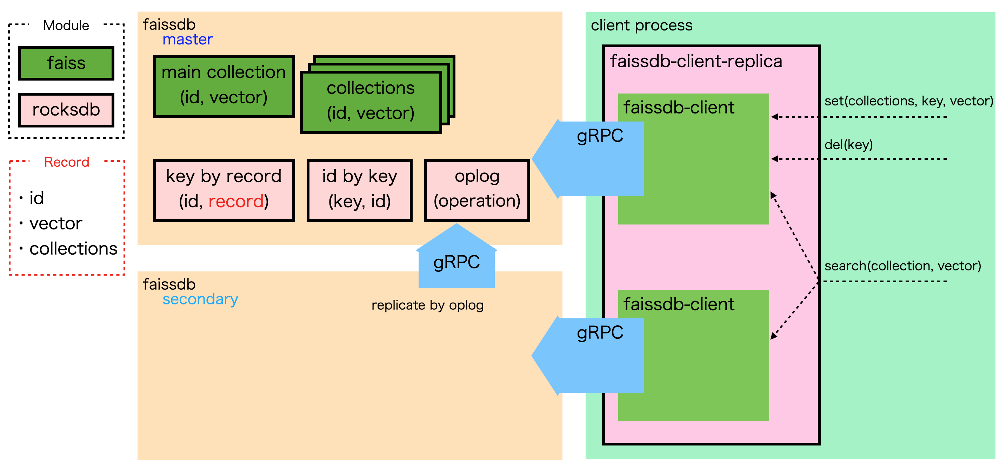

# Vector search platform with faiss
## Feature
- Store vector data indexed by [Faiss](https://github.com/facebookresearch/faiss) in [RocksDB](https://rocksdb.org//).
- Multiple Faiss indexes can be maintained.
- Set, Delete, Search operations are supported.
- Simple replication is supported.
- Faiss indexes are always sync with local storage to restart process quickly.
- Provides [gRPC](https://grpc.io/) based client I/F, so easy to develop clients.

## About Faiss
Faiss is one of the most advanced ANN (approximate nearest neighbor) search library.
However, Faiss is fundamentally designed to working on memory, so it requires complicated ID management and data perpetuation by low layer programing language to using for search platform.

## Architecture

### Set operation
1. Connect to PRIMARY faissdb node.
2. Call set() with `uniqkey`, `vector` and `collectionNames`. collectionNames is optional.
3. faissdb associate `uniqkey` and inner ID by searching `uniqkey` from stored data or generate for new `uniqkey` and store the association.
4. faissdb add the vector with ID to "main" Faiss index and other indexes specifed by collectionNames.
5. Finally, add oplog for replication.

### Del operation
Almost same as Set.

### Search operation
1. Connect to PRIMARY or SECONDARY faissdb node.
2. Call search() with `number of result`, `vector` and `collectionName`. collectionNames is optional.
3. faissdb search from "main" or specified Faiss index, will obtain IDs and distances as a result. And get `uniqkey` by ID from assciation.
4. faissdb returns `distances` and `uniqkeys`

## Client
- Call [gRPC](/faissdb/protos/feature.proto) directly
- [nodejs](https://github.com/crumbjp/faissdb_client_node)

## Plan
|  supported version  |  feature  |
| ---- | ---- |
|  alpha  |  simple replication  |
|  N/A  | auto promotion from SECONDARY to PRIMARY if needed |
|  N/A  | Adding new Faiss index without restart |
